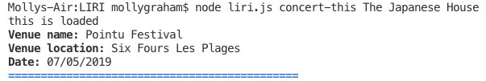
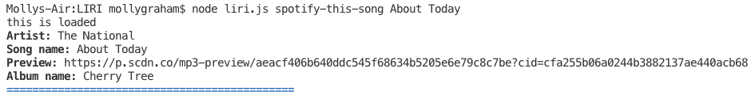
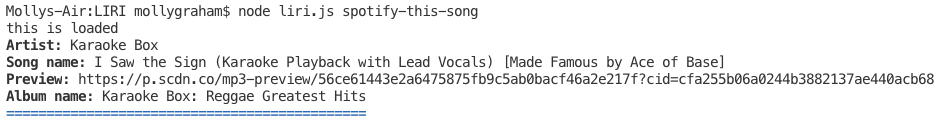
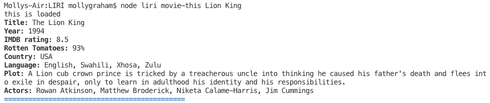
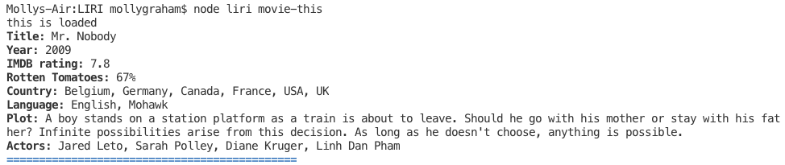
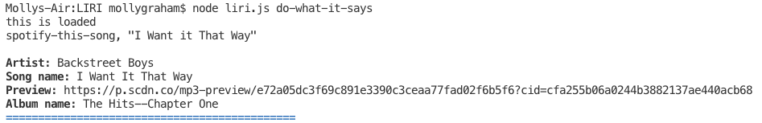

# LIRI
Homework assignment for module #10 (U.T. Coding Bootcamp)

## Motivation
I created this program to gain experience in writing a command line node app. 

## How to Use
This app provides you, the user, with data pertaining to four different commands using the command line. 

#### 1. Type "node liri.js **concert-this** (whatever artist/band name you like)" in the command line, and you will receive: 
* Name of the venue
* Venue location
* Date of the Event 

**EXAMPLE**

#### 2. Type "node liri.js **spotify-this-song** (whatever song you like)" in the command line,and you will receive:
* Artist(s)
* The song's name
* A preview link of the song from Spotify
* The album that the song is from

**EXAMPLE**

#### If you don't provide a specific song, data for a default song ("The Sign") will be displayed.

**EXAMPLE**

#### 3. Type "node liri.js **movie-this** (whatever movie you like)" in the command line, and you will receive:
* Title of the movie
* Year the movie came out
* IMDB Rating of the movie
* Rotten Tomatoes Rating of the movie
* Country where the movie was produced
* Language of the movie
* Plot of the movie
* Actors in the movie

**EXAMPLE**

#### If you don't provide a specific movie, data for a default movie ("Mr. Nobody") will be displayed.

**EXAMPLE**

#### 4.Type "node liri.js **do-what-it-says**" in the command line, and you will receive:
* The contents and functionality of whatever exists in random.txt

**EXAMPLE**

## Technology Used
* Node.js
* The use of the following APIs/libraries acquired through the use of npm packages: Moment.js, OMDB API, Spotify API, Bands in Town API

## Process
I first created API keys in order to access the APIs. I then stored the private keys for Spotify in an .env file. I require access to this file using the dotenv package. 

After this, I created functions for each command (movie-this, concert-this, etc...) and called the data from the APIs using an axios function.

Once I had all four functions, I then created a switch/case statement in order to make the program work.

### Portfolio
**If you'd like to see more of my work, check out my portfolio at https://mollyclaire.github.io/Responsive-Portfolio/**

